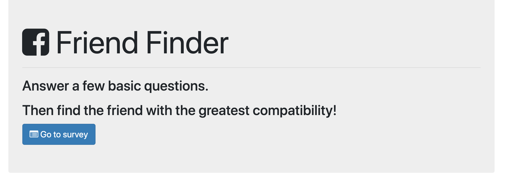
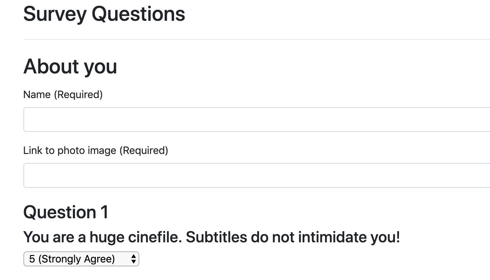

# Friend Finder 👫🔎🧐

### Overview

A compatibility-based "FriendFinder" application -- basically a dating app. This full-stack site takes in results from users' surveys, and compares the answers with those from other users. The app then displays the name and picture of the user with the best overall match.

Express is handling the routing. It is deployed to Heroku ... so please fill it out!!**

### Heroku

You can find a the app located here:  https://friend-finder-ysl.herokuapp.com/

👾 Rachael

**message me if we match 😉

###

<kbd>
  
</kbd>

###

Enter your Name and a link to a photo!  Then choose from the dropdown menus: 1 to 5 as to how much you agree with the questions.

<kbd>
  
</kbd>
